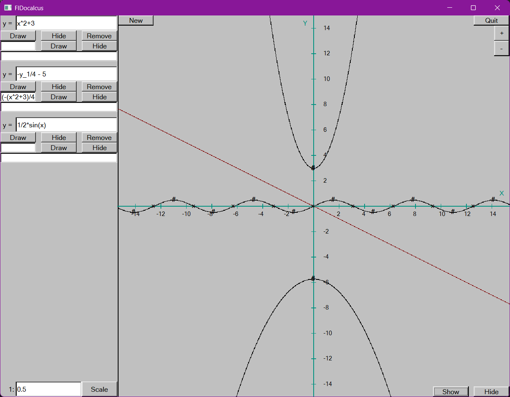

# Graphic Calculator: FIDocalcus Documentation

**Project of three first-year MIPT AES DAFE students (for engineering practical work in the first semester) in FLTK C++**

<div align="center">
  
</div>

## Documentation

Project's [documentation](https://bpla-team.github.io/graphic_calculator) generated with Doxygen.

## Contents

- [Description](#description)
- [Features](#features)
- [Installation and Building](#installation-and-building)
- [Project Structure](#project-structure)
- [Mathematical Capabilities](#mathematical-capabilities)
- [Architecture Overview](#architecture-overview)
- [Used Libraries](#used-libraries)
- [Authors](#authors)

## Description

This is a sophisticated **graphical calculator** that goes far beyond basic arithmetic. It features a complete mathematical expression parser, advanced computation algorithms, and real-time graphing with proper domain handling.

The application implements robust mathematical algorithms including **reverse Polish notation** for expression evaluation, **numerical differentiation** for derivatives, **golden section search** for extremes, and intelligent **domain segmentation** for discontinuous functions.

Built with **FLTK** for cross-platform GUI and a clean separation between frontend visualization and backend mathematical core.

## Features

### 🧮 Advanced Expression Parser

- Supports complex mathematical expressions with variables and functions
- Elementary functions: `sin(x)`, `cos(x)`, `tan(x)`, `exp(x)`, `ln(x)`
- Basic operations: `+`, `-`, `*`, `/`, `^` (power)
- Function dependencies (y₂ can reference y₁)

### 📈 Smart Graphing System

- Automatic domain detection and segmentation
- Plots only valid regions of functions
- Real-time graphing with configurable precision
- Proper handling of discontinuities and asymptotes
- Coordinate axes with intelligent marking

### 🔍 Mathematical Analysis

- **Root finding**: Numerical methods for function zeros
- **Extreme detection**: Local minima/maxima using golden section search
- **Function intersections**: Points where two functions cross
- **Derivative computation**: Numerical differentiation
- **Domain segmentation**: Identifies valid intervals for functions

### 🎯 Interactive Interface

- Multiple function management with individual controls
- Show/hide graphs and derivatives
- Dynamic error reporting and validation
- Configurable precision and computation parameters
- Clean, intuitive widget-based layout

## Installation and Building

### Prerequisites

- **C++ Compiler** with C++17 support
- **FLTK 1.3.8+** (Fast Light Toolkit)
- **CMake 3.20+**
- **OpenGL** (for FLTK rendering)

### Building on Windows with MSYS2

1. **Install MSYS2** from [msys2.org](https://www.msys2.org/)

2. **Install required packages** in MSYS2 terminal:

```bash
pacman -S mingw-w64-x86_64-gcc
pacman -S mingw-w64-x86_64-cmake
pacman -S mingw-w64-x86_64-fltk
pacman -S mingw-w64-x86_64-ninja
```

3. **Clone the repository**:

```bash
git clone https://github.com/BPLA-Team/graphic_calculator
cd graphic_calculator
```

4. **Build with CMake**:

```bash
mkdir build && cd build
cmake -G "MinGW Makefiles" ..
cmake --build .
```

5. **Run the application**:

```bash
./graphic_calculator.exe
```

### Building on Linux

1. **Install dependencies** (Ubuntu/Debian):

```bash
sudo apt-get install build-essential cmake libfltk1.3-dev libgl1-mesa-dev
```

2. **Build the project**:

```bash
mkdir build && cd build
cmake ..
make
./graphic_calculator
```

### Building on macOS

1. **Install dependencies** with Homebrew:

```bash
brew install fltk cmake
```

2. **Build the project**:

```bash
mkdir build && cd build
cmake ..
make
./graphic_calculator
```

## Project Structure

```console
graphic_calculator/
|
| ─── frontend/
|       | ─── Graph_lib/
|       |       |---Shapes.h
|       |       |---Shapes.cpp
|       |       |---Widgets.h
|       |       |---Widgets.cpp
|       |       |---Window.h
|       |       |---Window.cpp
|       |       |---Point.h
|       |       `---fltk.h
|       |
|       | ─── Graphix_calc/
|       |       |---Axis.h
|       |       |---Axis.cpp
|       |       |---Graphix.h
|       |       |---Graphix.cpp
|       |       |---Segmented_graphix.h
|       |       |---Segmented_graphix.cpp
|       |       |
|       |       |---Function_box.h
|       |       |---Function_box.cpp
|       |       |---Point_box.h
|       |       |---Point_box.cpp
|       |       |---Bothput_box.h
|       |       |---Bothput_box.cpp
|       |       `---Numbed_button.h
|       |
|       | ─── Graphix_window/
|       |       |---Graphix_window.h
|       |       |---Graphix_window_init.cpp
|       |       |---Graphix_window_callbacks.cpp
|       |       `---Graphix_window_updaters.cpp
|       |
|       ` ─── utility/
|               |---constants.h
|               |---utilities.cpp
|               `---utility.h
|
| ─── backend/
|       | ─── Math_calc/
|       |       |---domain_segments.cpp
|       |       |---domain_segments.h
|       |       |
|       |       |---function_roots.h
|       |       |---function_roots.cpp
|       |       |---function_extremes.h
|       |       |---function_extremes.cpp
|       |       |---function_crosses.h
|       |       |---function_crosses.cpp
|       |       `---math_base.h
|       |
|       | ─── Math_func/
|       |       |---expose_func_str.h
|       |       |---expose_func_str.cpp
|       |       |
|       |       |---function.h
|       |       |---function.cpp
|       |       `---function_validation.cpp
|       |
|       | ─── utility/
|       |       |---constants.h
|       |       |---utilities.cpp
|       |       `---utility.h
|       |
|       `---temp_help.h
|
|
|---frontend.h
|---backend.h
`---main.cpp

```

## Mathematical Capabilities

### Expression Evaluation

- **Reverse Polish Notation** for efficient computation
- **Lexical analysis** and **syntax validation**
- **Function composition** and **recursive dependencies**
- **Error handling** for invalid expressions and domains

### Numerical Analysis

- **Root Finding**: Uses sign change detection and interval analysis
- **Extreme Detection**: Golden section search for minima/maxima
- **Derivative Computation**: Central difference approximation
- **Intersection Points**: Root finding on function differences

### Domain Handling

- **Automatic Segmentation**: Identifies valid intervals for plotting
- **Exception Handling**: Graceful handling of undefined regions
- **Precision Control**: Configurable computation accuracy

## Architecture Overview

### Frontend-Backend Separation

- **Frontend**: Handles pixels, graphics, and user interaction (FLTK-based)
- **Backend**: Manages floating-point numbers and mathematical computations
- **Clean Interface**: Well-defined APIs between components

### Key Components Interaction

```
User Input → Function_box → Math_func::function → Mathematical Analysis → Graphix Visualization
     ↓              ↓               ↓                       ↓                     ↓
   FLTK        Validation     RPN Evaluation        Numerical Methods        FLTK Drawing
```

### Widget System

- **Function_box**: Complete function management (input, buttons, output)
- **Numbed_button**: Numbered buttons for function identification
- **Axis**: Intelligent coordinate system with automatic marking
- **Graphix**: Base graphing system with domain awareness

## Used Libraries

- [**FLTK**](https://www.fltk.org/) (Fast Light Toolkit): Cross-platform GUI library
- [**CMake**](https://cmake.org/): Build system and project configuration
- [**OpenGL**](https://www.opengl.org/): Graphics rendering (via FLTK)
- **Standard Library**: Comprehensive C++17 standard library usage

### FLTK Integration

The project extends FLTK with custom widgets and shapes:

- Custom `Shape` hierarchy for mathematical graphics
- `Widget` system for interactive elements
- Coordinate conversion between pixel and mathematical spaces

## Development Notes

### Code Philosophy

- **RAII** principles for resource management
- **Exception safety** throughout the codebase
- **Clear separation** of concerns between modules
- **Extensive documentation** with Doxygen-style comments

### Coordinate Systems

- **Pixel Coordinates**: Integer-based for FLTK rendering
- **Mathematical Coordinates**: Double-based for computations
- **Automatic Conversion**: Between coordinate systems

## Authors

**[Romanov Fedor](https://github.com/Romanov-Fedor)**

**[Rybalkin Ilya](https://github.com/Stargazer2005)**

**[Krivoruchko Dmitry](https://github.com/UmbrellaLeaf5)**
